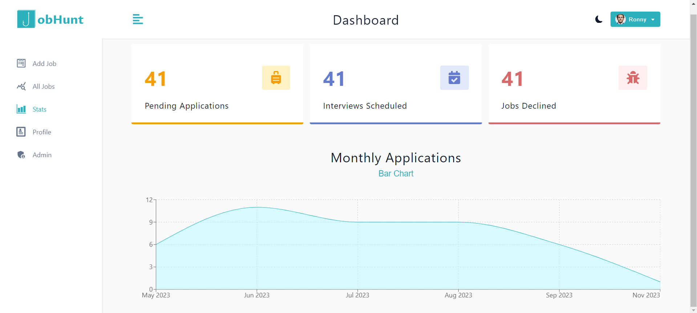

# [JOBHUNT](https://jobhunt-x1z9.onrender.com/)


Jobhunt is a job tracking application designed to streamline the job search process by allowing users to track their job applications, manage interviews, and monitor application progress. Built with Vite for the frontend and utilizing React Router for frontend routing, Jobhunt also incorporates features like user authentication, role-based access control, and data caching with React Query. The backend is powered by Express.js and MongoDB, providing a robust and scalable infrastructure for storing and managing user data.

## Demo Images:

### Home


### Login & Register


### Dashboard


### Stats




### Profile


### Admin


## Features

### Application Navigation:

- Landing Page: Allows users to login or explore the application as a demo user.
- Register & Login Page: Enables new users to register and existing users to login.
- Dashboard: Provides a centralized hub for users to navigate to different sections of the application, including adding jobs, viewing all jobs, accessing statistics, managing profile, and accessing admin functionalities.
  - Sidebar: Offers quick access to key features such as adding jobs, viewing all jobs, statistics, profile management, and admin functionalities.
  - Navbar: Includes options for toggling dark mode, displaying the username, and logging out.
- All Jobs: Displays a list of all job applications with options to search for specific jobs, edit job details, and delete job entries.
- Stats: Provides insights into job application statistics such as pending applications, pending interviews, jobs declined, and monthly application trends through bar charts and line graphs.
- Profile: Allows users to upload profile images to Cloudinary and manage profile information such as first name, last name, etc.
- Admin: Accessible only to admin users, provides functionalities to view current users and total jobs.

## Tech Stack

### Frontend:

- React Router
- Styled components
- Figma
- React icons
- Thunder Client

### Backend:

- Express.js
- MongoDB
- Mongoose
- Axios
- Middleware
- Controller & router
- Bcrypt & Bcryptjs
- JSON Web Token
- Multer
- Cloudinary

### Additional Libraries:

- React Query
- Helmet
- Express Validator
- Express Rate Limit
- Express Mongo Sanitize
- Status Codes

## Server Setup

### Create package.json

```sh
npm init -y
```

### Create and Test server.js

```sh
node server
```

server.js

```js
import { value } from "./test.js";
console.log(value);
```

Install Packages and Setup Install Script

```sh
npm install bcryptjs@2.4.3 concurrently@8.0.1 cookie-parser@1.4.6 dayjs@1.11.7 dotenv@16.0.3 express@4.18.2 express-async-errors@3.1.1 express-validator@7.0.1 http-status-codes@2.2.0 jsonwebtoken@9.0.0 mongoose@7.0.5 morgan@1.10.0 multer@1.4.5-lts.1 nanoid@4.0.2 nodemon@2.0.22 cloudinary@1.37.3 dayjs@1.11.9 datauri@4.1.0 helmet@7.0.0 express-rate-limit@6.8.0 express-mongo-sanitize@2.2.0
```

Install Packages in Root and Client

```sh
npm run setup-project
```

### Setup Basic Express

- install express and nodemon.
- setup a basic server which listening on PORT=5100
- create a basic home route which sends back "hello world"
- setup a script with nodemon package.

### [Express Docs](https://expressjs.com/)

Express is a fast and minimalist web application framework for Node.js. It simplifies the process of building web applications by providing a robust set of features for handling HTTP requests, routing, middleware, and more. Express allows you to create server-side applications and APIs easily, with a focus on simplicity and flexibility.

### [Nodemon Docs](https://nodemon.io/)

Nodemon is a development tool that improves the developer experience. It monitors your Node.js application for any changes in the code and automatically restarts the server whenever a change is detected. This eliminates the need to manually restart the server after every code modification, making the development process more efficient and productive. Nodemon is commonly used during development to save time and avoid the hassle of manual server restarts.

### [Thunder Client](https://www.thunderclient.com/)

Thunder Client is a popular Visual Studio Code extension that facilitates API testing and debugging. It provides a user-friendly interface for making HTTP requests and viewing the responses, allowing developers to easily test APIs, examine headers, and inspect JSON/XML payloads. Thunder Client offers features such as environment variables, request history, and the ability to save and organize requests for efficient development workflows.

- install and test home route

#### Accept JSON

Setup express middleware to accept json

### Morgan and Dotenv

[Morgan](https://www.npmjs.com/package/morgan)

HTTP request logger middleware for node.js.

[Dotenv](https://www.npmjs.com/package/dotenv)

A module that loads environment variables from a .env file into process.env.

```sh
npm i morgan@1.10.0 dotenv@16.0.3
```

server.js

```js
import morgan from "morgan";

app.use(morgan("dev"));
```

### [Nanoid](https://www.npmjs.com/package/nanoid)

The nanoid package is a software library used for generating unique and compact identifiers in web applications or databases. It creates short and URL-safe IDs by combining random characters from a set of 64 characters. Nanoid is a popular choice due to its simplicity, efficiency, and collision-resistant nature.

### [MongoDb](https://www.mongodb.com/)

MongoDB is a popular NoSQL database that provides a flexible and scalable approach to storing and retrieving data. It uses a document-oriented model, where data is organized into collections of JSON-like documents. MongoDB offers high performance, horizontal scalability, and easy integration with modern development frameworks, making it suitable for handling diverse data types and handling large-scale applications.

MongoDB Atlas is a fully managed cloud database service provided by MongoDB, offering automated deployment, scaling, and monitoring of MongoDB clusters, allowing developers to focus on building their applications without worrying about infrastructure management..

### [Mongoose](https://mongoosejs.com/)

Mongoose is an Object Data Modeling (ODM) library for Node.js that provides a straightforward and elegant way to interact with MongoDB. It allows developers to define schemas and models for their data, providing structure and validation. Mongoose also offers features like data querying, middleware, and support for data relationships, making it a powerful tool for building MongoDB-based applications.

### [Express Async Errors](https://www.npmjs.com/package/express-async-errors)

The "express-async-errors" package is an Express.js middleware that helps handle errors that occur within asynchronous functions. It catches unhandled errors inside async/await functions and forwards them to Express.js's error handling middleware, preventing the Node.js process from crashing. It simplifies error handling in Express.js applications by allowing you to write asynchronous code without worrying about manually catching and forwarding errors.

### [Http Status Codes](https://www.npmjs.com/package/http-status-codes)

A library for HTTP status codes is useful because it provides a comprehensive and standardized set of codes that represent the outcome of HTTP requests. It allows developers to easily understand and handle different scenarios during web development, such as successful responses, client or server errors, redirects, and more. By using a status code library, developers can ensure consistent and reliable communication between servers and clients, leading to better error handling and improved user experience.

###

```sh
npm i http-status-codes@2.2.0
```

- 200 OK OK
- 201 CREATED Created

- 400 BAD_REQUEST Bad Request
- 401 UNAUTHORIZED Unauthorized

- 403 FORBIDDEN Forbidden
- 404 NOT_FOUND Not Found

- 500 INTERNAL_SERVER_ERROR Internal Server Error

  - refactor 200 response in all controllers

#### errors/customErrors.js

```js
import { StatusCodes } from "http-status-codes";
export class NotFoundError extends Error {
  constructor(message) {
    super(message);
    this.name = "NotFoundError";
    this.statusCode = StatusCodes.NOT_FOUND;
  }
}
```

This code defines a custom error class NotFoundError that extends the built-in Error class in JavaScript. The NotFoundError class is designed to be used when a requested resource is not found, and it includes a status code of 404 to indicate this.

Here's a breakdown of the code:

_class NotFoundError extends Error_: This line defines a new class NotFoundError that extends the built-in Error class. This means that NotFoundError inherits all of the properties and methods of the Error class, and can also define its own properties and methods.

_constructor(message)_: This is the constructor method for the NotFoundError class, which is called when a new instance of the class is created. The message parameter is the error message that will be displayed when the error is thrown.

_super(message)_: This line calls the constructor of the Error class and passes the message parameter to it. This sets the error message for the NotFoundError instance.

_this.name = "NotFoundError"_: This line sets the name property of the NotFoundError instance to "NotFoundError". This is a built-in property of the Error class that specifies the name of the error.

_this.statusCode = 404_: This line sets the statusCode property of the NotFoundError instance to 404. This is a custom property that is specific to the NotFoundError class and indicates the HTTP status code that should be returned when this error occurs.

By creating a custom error class like NotFoundError, you can provide more specific error messages and properties to help with debugging and error handling in your application.

#### Custom Error

jobController.js

```js
import { NotFoundError } from "../customErrors.js";
if (!job) throw new NotFoundError(`no job with id : ${id}`);
```

#### Usage in Controller

```js
import { NotFoundError } from "../customErrors.js";
if (!job) throw new NotFoundError(`no job with id : ${id}`);
```

### Validation Layer

### [Express Validator](https://express-validator.github.io/docs/)

```sh
npm i express-validator@7.0.1
```

### Hash Passwords

### [bcryptjs](https://www.npmjs.com/package/bcryptjs)

```sh
npm i bcryptjs@2.4.3
```

#### authController.js

```js
import bcrypt from "bcryptjs";

const register = async (req, res) => {
  // a random value that is added to the password before hashing
  const salt = await bcrypt.genSalt(10);
  const hashedPassword = await bcrypt.hash(req.body.password, salt);
  req.body.password = hashedPassword;

  const user = await User.create(req.body);
};
```

_const salt = await bcrypt.genSalt(10);_

This line generates a random "salt" value that will be used to hash the password. A salt is a random value that is added to the password before hashing, which helps to make the resulting hash more resistant to attacks like dictionary attacks and rainbow table attacks. The genSalt() function in bcrypt generates a random salt value using a specified "cost" value. The cost value determines how much CPU time is needed to calculate the hash, and higher cost values result in stronger hashes that are more resistant to attacks.

In this example, a cost value of 10 is used to generate the salt. This is a good default value that provides a good balance between security and performance. However, you may need to adjust the cost value based on the specific needs of your application.

_const hashedPassword = await bcrypt.hash(password, salt);_

This line uses the generated salt value to hash the password. The hash() function in bcrypt takes two arguments: the password to be hashed, and the salt value to use for the hash. It then calculates the hash value using a one-way hash function and the specified salt value.

The resulting hash value is a string that represents the hashed password. This string can then be stored in a database or other storage mechanism to be compared against the user's password when they log in.

By using a salt value and a one-way hash function, bcrypt helps to ensure that user passwords are stored securely and are resistant to attacks like password cracking and brute-force attacks.

### BCRYPT vs BCRYPTJS :

- Bcryptjs is preferred for its cross-platform compatibility, improved security, ease of use, and ongoing maintenance.
- Cross-platform compatibility: bcrypt is a native Node.js module that uses C++ bindings, which can make it difficult to install and use on some platforms. bcryptjs, on the other hand, is a pure JavaScript implementation that works on any platform.

- Security: While both bcrypt and bcryptjs use the same underlying algorithm for hashing passwords, bcryptjs is designed to be more resistant to certain types of attacks, such as side-channel attacks.

- Ease of use: bcryptjs has a simpler and more intuitive API than bcrypt, which can make it easier to use and integrate into your application.

- Overall, while bcrypt and bcryptjs are both good choices for hashing passwords in Node.js applications, bcryptjs is considered to be a better choice for its cross-platform compatibility, improved security, ease of use, and ongoing maintenance.

### [JSON Web Token](https://jwt.io/introduction)

A JSON Web Token (JWT) is a compact and secure way of transmitting data between parties. It is often used to authenticate and authorize users in web applications and APIs. JWTs contain information about the user and additional metadata, and can be used to securely transmit this information

**WT_SECRET** represents the secret key used to sign the JWT. When creating a JWT, the payload (data) is signed with this secret key to generate a unique token. The secret key should be kept secure and should not be disclosed to unauthorized parties.

**JWT_EXPIRES_IN** specifies the expiration time for the JWT. It determines how long the token remains valid before it expires. The value of JWT_EXPIRES_IN is typically provided as a duration, such as "1h" for one hour or "7d" for seven days. Once the token expires, it is no longer considered valid and can't be used for authentication or authorization purposes.

These environment variables (JWT_SECRET and JWT_EXPIRES_IN) are read from the system environment during runtime, allowing for flexibility in configuration without modifying the code.

#### HTTP Only Cookie

An HTTP-only cookie is a cookie that can't be accessed by JavaScript running in the browser. It is designed to help prevent cross-site scripting (XSS) attacks, which can be used to steal cookies and other sensitive information.

##### HTTP Only Cookie VS Local Storage

An HTTP-only cookie is a type of cookie that is designed to be inaccessible to JavaScript running in the browser. It is primarily used for authentication purposes and is a more secure way of storing sensitive information like user tokens. Local storage, on the other hand, is a browser-based storage mechanism that is accessible to JavaScript, and is used to store application data like preferences or user-generated content. While local storage is convenient, it is not a secure way of storing sensitive information as it can be accessed and modified by JavaScript running in the browser.

authControllers.js

```js
const oneDay = 1000 * 60 * 60 * 24;

res.cookie("token", token, {
  httpOnly: true,
  expires: new Date(Date.now() + oneDay),
  secure: process.env.NODE_ENV === "production",
});

res.status(StatusCodes.CREATED).json({ msg: "user logged in" });
```

This snippet sets a cookie with the name "token" and a value of token, which is the JWT that was generated for the user. The ... represents an object containing additional options for the cookie.

_httpOnly: true_: This option makes the cookie inaccessible to JavaScript running in the browser. This helps to prevent cross-site scripting (XSS) attacks, which can be used to steal cookies and other sensitive information.

_expires: new Date(Date.now() + oneDay)_: This option sets the expiration time for the cookie. In this case, the cookie will expire one day from the current time (as represented by Date.now() + oneDay).

_secure: process.env.NODE_ENV === 'production'_: This option determines whether the cookie should be marked as secure or not. If the NODE_ENV environment variable is set to "production", then the cookie is marked as secure, which means it can only be transmitted over HTTPS. This helps to prevent man-in-the-middle (MITM) attacks, which can intercept and modify cookies that are transmitted over unsecured connections.

### [Axios Docs](https://axios-http.com/docs/intro)

Axios: A library for making HTTP requests from web browsers or Node.js.

### React Router - Action

Route actions are the "writes" to route loader "reads". They provide a way for apps to perform data mutations with simple HTML and HTTP semantics while React Router abstracts away the complexity of asynchronous UI and revalidation.

#### useNavigation() and navigation.state

This hook tells you everything you need to know about a page navigation to build pending navigation indicators and optimistic UI on data mutations.

#### Navigation States

- idle: No navigation pending.
- submitting: A route action is being called due to a form submission using POST, PUT, PATCH, or DELETE.
- loading: The loaders for the next routes are being called to render the next page.

### [React Toastify](https://fkhadra.github.io/react-toastify/introduction)

React Toastify: A library to display notifications in your app.

### [Multer](https://github.com/expressjs/multer)

Multer is a popular middleware package for handling multipart/form-data in Node.js web applications. It is commonly used for handling file uploads. Multer simplifies the process of accepting and storing files submitted through HTTP requests by providing an easy-to-use API. It integrates seamlessly with Express.js and allows developers to define upload destinations, file size limits, and other configurations.

```js
import multer from "multer";

const storage = multer.diskStorage({
  destination: (req, file, cb) => {
    // set the directory where uploaded files will be stored
    cb(null, "public/uploads");
  },
  filename: (req, file, cb) => {
    const fileName = file.originalname;
    // set the name of the uploaded file
    cb(null, fileName);
  },
});
const upload = multer({ storage });

export default upload;
```

routes/userRouter.js

```js
import upload from "../middleware/multerMiddleware.js";

router.patch(
  "/update-user",
  upload.single("avatar"),
  validateUpdateUserInput,
  updateUser
);
```

- First, the multer package is imported.

- Then, a storage object is created using multer.diskStorage(). This object specifies the configuration for storing uploaded files. In this case, the destination function determines the directory where the uploaded files will be saved, which is set to 'public/uploads'. The filename function defines the name of the uploaded file, which is set to the original filename.

- Next, a multer middleware is created by passing the storage object as a configuration option. This multer middleware will be used to handle file uploads in the application.

- In this case, upload is an instance of the Multer middleware that was created earlier. The .single() method is called on this instance to indicate that only one file will be uploaded. The argument 'avatar' specifies the name of the field in the HTTP request that corresponds to the uploaded file.

- When this middleware is used in an HTTP route handler, it will process the incoming request and extract the file attached to the 'avatar' field. Multer will then save the file according to the specified storage configuration, which includes the destination directory and filename logic defined earlier. The uploaded file can be accessed in the route handler using req.file.

### [Cloudinary](https://cloudinary.com/)

Cloudinary is a cloud-based media management platform that helps businesses store, optimize, and deliver images and videos across the web. It provides developers with an easy way to upload, manipulate, and serve media assets, enabling faster and more efficient delivery of visual content on websites and applications. Cloudinary also offers features like automatic resizing, format conversion, and responsive delivery to ensure optimal user experiences across different devices and network conditions.

## [React Query Docs](https://tanstack.com/query/v4/docs/react/overview)

React Query is a powerful library that simplifies data fetching, caching, and synchronization in React applications. It provides a declarative and intuitive way to manage remote data by abstracting away the complex logic of fetching and caching data from APIs. React Query offers features like automatic background data refetching, optimistic updates, pagination support, and more, making it easier to build performant and responsive applications that rely on fetching and manipulating data.

### Helmet

**Description**: helmet is a security package for Express.js applications that helps protect them by setting various HTTP headers to enhance security, prevent common web vulnerabilities, and improve overall application security posture.
Need: The package is needed to safeguard web applications from potential security threats, such as cross-site scripting (XSS) attacks, clickjacking, and other security exploits.

#### Example Usage

```js
import helmet from "helmet";
app.use(helmet());
```

### Express-mongo-sanitize

**Description**: express-mongo-sanitize is a middleware for Express.js that sanitizes user-supplied data coming from request parameters, body, and query strings to prevent potential NoSQL injection attacks on MongoDB databases.
Need: The package addresses the need to protect MongoDB databases from malicious attempts to manipulate data and helps ensure the integrity of data storage and retrieval.

### Express-rate-limit

**Description**: express-rate-limit is an Express.js middleware that helps control and limit the rate of incoming requests from a specific IP address or a set of IP addresses to protect the server from abuse, brute-force attacks, and potential denial-of-service (DoS) attacks.
Need: This package is necessary to manage and regulate the number of requests made to the server within a given time frame, preventing excessive usage and improving the overall stability and performance of the application.

### Example Usage

```js
import { useQuery } from "@tanstack/react-query";

const { data, isLoading, isError } = useQuery(["key"], fetchDataFunction);
```

## React Setup

### Vite Setup

```sh
npm create vite@latest projectName -- --template react
```

Install Client Packages

```sh
npm install @tanstack/react-query@4.29.5 @tanstack/react-query-devtools@4.29.6 axios@1.3.6 dayjs@1.11.7 react-icons@4.8.0 react-router-dom@6.10.0 react-toastify@9.1.2 recharts@2.5.0 styled-components@5.3.10
```

### Project Template

#### App.jsx

```jsx
import { RouterProvider } from "react-router-dom";
import { router } from "./routes/router";
import { GlobalStyles } from "./styled-components/GlobalStyles";
import { ToastContainer } from "react-toastify";
import "react-toastify/dist/ReactToastify.css";

const App = () => (
  <>
    <ToastContainer position="top-center" />
    <GlobalStyles />
    <RouterProvider router={router} />
  </>
);

export default App;
```

main.jsx

```jsx
import React from "react";
import ReactDOM from "react-dom/client";
import App from "./App.jsx";
import { QueryClientProvider, QueryClient } from "@tanstack/react-query";
import { ReactQueryDevtools } from "@tanstack/react-query-devtools";

const queryClient = new QueryClient();

ReactDOM.createRoot(document.getElementById("root")).render(
  <QueryClientProvider client={queryClient}>
    <App />
    <ReactQueryDevtools initialIsOpen={false} />
  </QueryClientProvider>
);
```

### Router and Routes

### [Multer](https://github.com/expressjs/multer)

Multer is a popular middleware package for handling multipart/form-data in Node.js web applications. It is commonly used for handling file uploads. Multer simplifies the process of accepting and storing files submitted through HTTP requests by providing an easy-to-use API. It integrates seamlessly with Express.js and allows developers to define upload destinations, file size limits, and other configurations.

```js
import multer from "multer";

const storage = multer.diskStorage({
  destination: (req, file, cb) => {
    // set the directory where uploaded files will be stored
    cb(null, "public/uploads");
  },
  filename: (req, file, cb) => {
    const fileName = file.originalname;
    // set the name of the uploaded file
    cb(null, fileName);
  },
});
const upload = multer({ storage });

export default upload;
```

#### routes/userRouter.js

```js
import upload from "../middleware/multerMiddleware.js";

router.patch(
  "/update-user",
  upload.single("avatar"),
  validateUpdateUserInput,
  updateUser
);
```

- First, the multer package is imported.

- Then, a storage object is created using multer.diskStorage(). This object specifies the configuration for storing uploaded files. In this case, the destination function determines the directory where the uploaded files will be saved, which is set to 'public/uploads'. The filename function defines the name of the uploaded file, which is set to the original filename.

- Next, a multer middleware is created by passing the storage object as a configuration option. This multer middleware will be used to handle file uploads in the application.

- In this case, upload is an instance of the Multer middleware that was created earlier. The .single() method is called on this instance to indicate that only one file will be uploaded. The argument 'avatar' specifies the name of the field in the HTTP request that corresponds to the uploaded file.

- When this middleware is used in an HTTP route handler, it will process the incoming request and extract the file attached to the 'avatar' field. Multer will then save the file according to the specified storage configuration, which includes the destination directory and filename logic defined earlier. The uploaded file can be accessed in the route handler using req.file.

### Global Styles

#### styled-components/GlobalStyles.js

```js
import { createGlobalStyle } from "styled-components";

export const GlobalStyles = createGlobalStyle`  /* Your global styles */`;
```

## Usage

1. Clone the repository.
1. Install dependencies for both the frontend and backend using npm install.
1. Run the server using npm run dev and the frontend using npm run dev commands.
1. Access the application in your browser at the specified URL (default: http://localhost:3000).

## Credits

- [React Router](https://reactrouter.com/en/main)
- [Styled Components](https://styled-components.com/)
- [Figma](https://www.figma.com/)
- [React Icons]()
- [Thunder Client](https://www.thunderclient.com/)
- [MongoDB](https://www.mongodb.com/)
- [Mongoose](https://mongoosejs.com/)
- [Axios](https://axios-http.com/docs/intro)
- [Multer](https://www.npmjs.com/package/multer)
- [Cloudinary](https://cloudinary.com/)
- [React Query](https://tanstack.com/query/v4/docs/framework/react/overview)
- [Helmet]()
- [Express Validator](https://express-validator.github.io/docs/)
- [Express Rate Limit](https://www.npmjs.com/package/express-rate-limit)
- [Express Mongo Sanitize](https://www.npmjs.com/package/express-mongo-sanitize)
- [Status Codes](https://www.npmjs.com/package/http-status-codes)
- [Mockaroo](https://www.mockaroo.com/)

## License

This project is licensed under the MIT License - see the LICENSE file for details.
